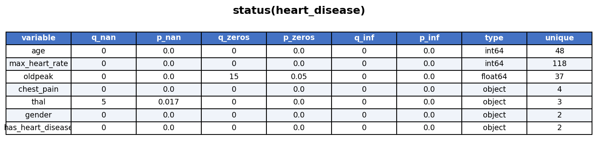
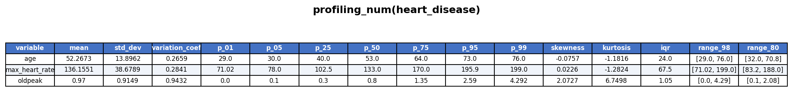
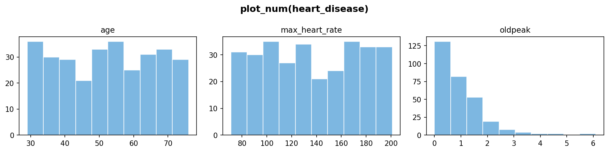
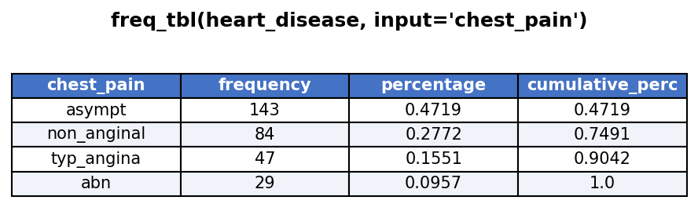
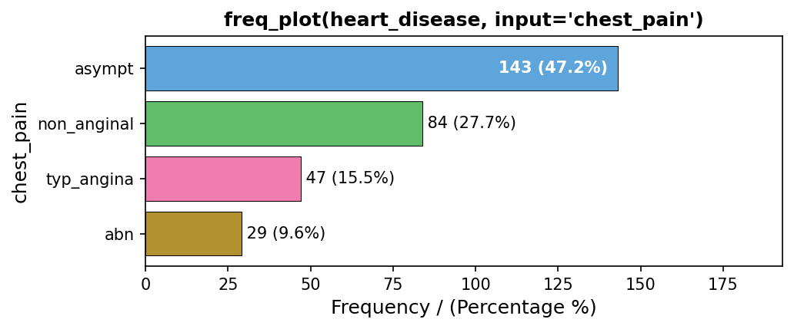
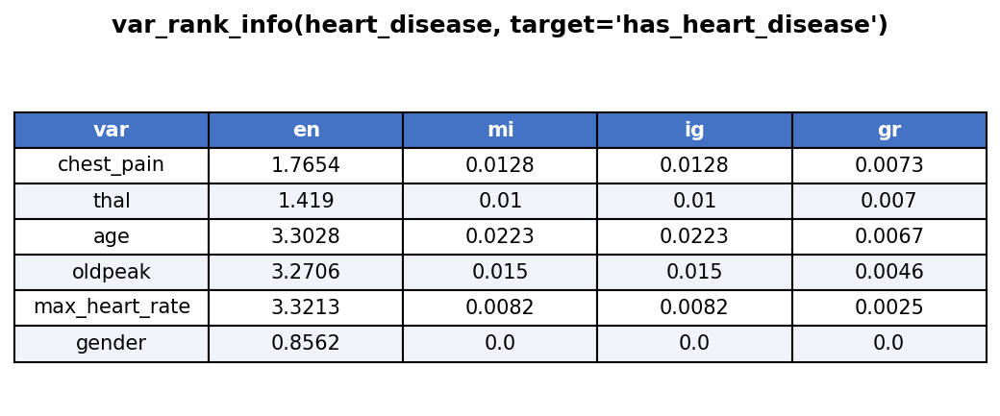
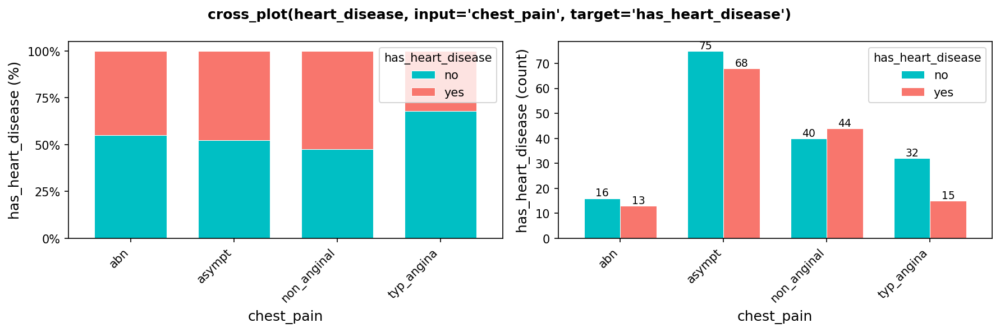
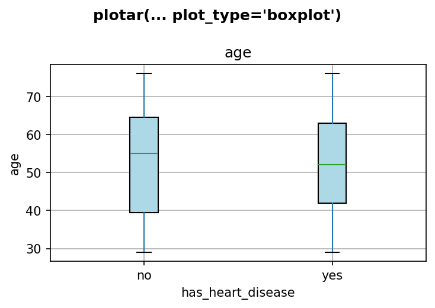
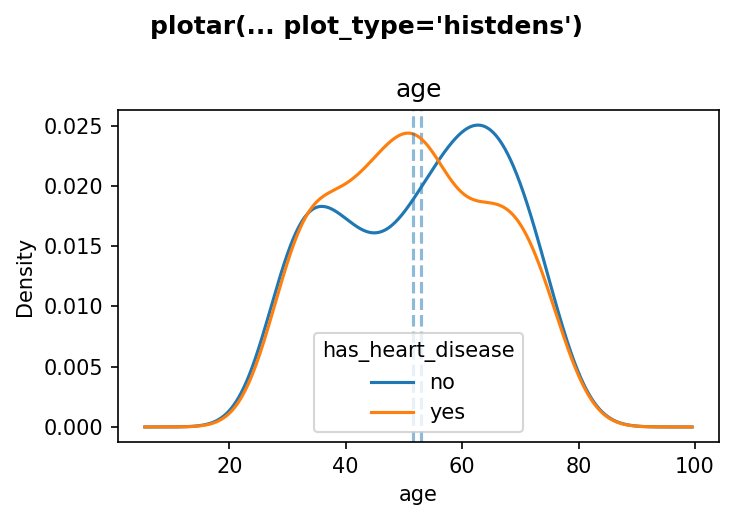
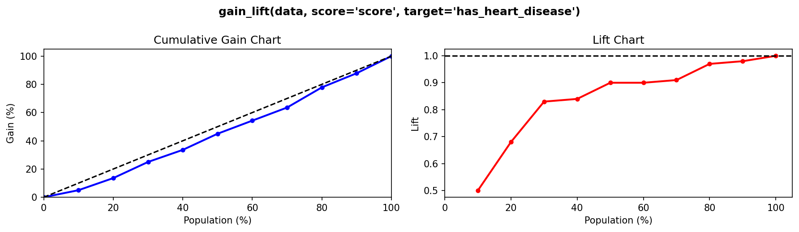

# funpymodeling

[](https://pypi.org/project/funpymodeling/)

A Python package designed for data scientists and teachers to speed up **Exploratory Data Analysis (EDA)**, **Data Preparation**, and **Model Performance** evaluation.

Companion package for the book [Data Science Live Book](https://livebook.datascienceheroes.com).

## Install

```bash
pip install funpymodeling
```

## Quick-start

```python
from funpymodeling import *
import pandas as pd
```

All functions are well documented. Access the documentation via `help(function_name)`.

Some functions have comments in the source code so users can open the black-box and learn how they were developed, or fine-tune/improve any of them.

---

## Exploratory Data Analysis

### `status` — Dataset health check

For each variable: quantity and percentage of zeros, NAs, and infinite values. Also reports data type and number of unique values.

```python
status(heart_disease)
```



### `profiling_num` — Numerical variable profiling

Returns mean, std_dev, variation_coef, percentiles (p_01 to p_99), skewness, kurtosis, IQR, range_98 and range_80.

```python
profiling_num(heart_disease)
```



### `plot_num` — Histograms for numerical variables

Plots histograms for all numerical variables in a single figure.

```python
plot_num(heart_disease)
plot_num(heart_disease, bins=20)
```



### `freq_tbl` — Frequency table for categorical variables

Returns frequency, percentage (as proportion 0 to 1), and cumulative percentage for each category. Handles `category` dtype, NaN values, and high-cardinality variables.

```python
freq_tbl(heart_disease, input='chest_pain')

# Multiple variables
freq_tbl(heart_disease, input=['chest_pain', 'gender'])

# All categorical variables at once
freq_tbl(heart_disease)
```



### `freq_plot` — Bar chart for categorical variables

Horizontal bar charts showing frequency and percentage for each category.

```python
freq_plot(heart_disease, input='chest_pain')
```



---

## Target & Variable Analysis

### `var_rank_info` — Variable importance via Information Theory

Computes entropy (en), mutual information (mi), information gain (ig), and gain ratio (gr) for each variable against the target.

```python
var_rank_info(heart_disease, target='has_heart_disease')
```



### `cross_plot` — Input vs. target distribution

Shows how the input variable relates to the target variable, with likelihood rates for each bin/bucket. Supports `plot_type='both'` (default), `'percentual'`, or `'quantity'`.

```python
cross_plot(heart_disease, input='chest_pain', target='has_heart_disease')

# Multiple variables at once
cross_plot(heart_disease, input=['age', 'chest_pain'], target='has_heart_disease')
```



### `plotar` — Boxplot and density histograms by target

Useful to visually assess whether a variable discriminates between target classes.

```python
# Boxplot
plotar(heart_disease, input='age',
       target='has_heart_disease', plot_type='boxplot')
```



```python
# Density histogram
plotar(heart_disease, input='age',
       target='has_heart_disease', plot_type='histdens')
```



Notes:
- `input` must be numeric and `target` must be categorical.
- `target` can be multi-class (not only binary).

### `categ_analysis` — Categorical variable vs. binary target

Profiling of a categorical input against a binary target: representativeness (`perc_rows`) and accuracy (`perc_target`) of each category.

```python
categ_analysis(data, input='country', target='has_flu')
```

### `corr_pair` — Pairwise correlation

Calculate pairwise correlation (R and R²) among all numeric features.

```python
corr_pair(heart_disease)
```

---

## Data Preparation

### `equal_freq` — Equal-frequency binning

Splits a numeric variable into `n_bins` segments of approximately equal size.

```python
equal_freq(heart_disease['age'], n_bins=5)
```

### `discretize_get_bins` / `discretize_df` — Two-step discretization

First get the bins, then apply them. Useful for applying the same bins to train and test sets.

```python
d_bins = discretize_get_bins(heart_disease, input=['age', 'oldpeak'], n_bins=5)
heart_disease_disc = discretize_df(heart_disease, d_bins)
```

### `convert_df_to_categoric` — Convert all columns to categorical

Numeric variables are binned using equal-frequency; other variables are cast to string.

```python
convert_df_to_categoric(heart_disease, n_bins=5)
```

### `range01` — Min-max normalization

Scales a numeric vector to the [0, 1] range.

```python
range01(heart_disease['oldpeak'])
```

### `auto_grouping` — Reduce cardinality via clustering

Groups categories of a high-cardinality variable using KMeans on profiling metrics (`perc_rows`, `perc_target`).

```python
res = auto_grouping(data, input='country', target='has_flu', n_groups=3)
res['df_equivalence']   # mapping from original to new categories
res['recateg_results']  # profiling of the new groups
```

---

## Outlier Treatment

### `tukey_outlier` / `hampel_outlier` — Outlier thresholds

```python
tukey_outlier(heart_disease['age'])
# {'lower': ..., 'upper': ...}

hampel_outlier(heart_disease['age'])
# {'lower': ..., 'upper': ...}
```

### `prep_outliers` — Handle outliers in a DataFrame

Two modes:
- `type='stop'` — clips values at the threshold (recommended for predictive modeling)
- `type='set_na'` — converts outliers to NaN (recommended for statistical analysis)

Three methods: `'tukey'`, `'hampel'`, `'bottom_top'`.

```python
# Clip outliers using Tukey method
prep_outliers(heart_disease, input=['age', 'oldpeak'], type='stop', method='tukey')

# Set outliers to NA using Hampel method
prep_outliers(heart_disease, input=['age'], type='set_na', method='hampel')

# Bottom/top percentile
prep_outliers(heart_disease, input=['age'], type='stop',
              method='bottom_top', top_percent=0.01, bottom_percent=0.01)
```

---

## Predictive Model Performance

### `gain_lift` — Gain and lift curves

Higher values at the beginning of the population implies a better model.

```python
gain_lift(data=scored_data, score='score', target='has_heart_disease')
```



### `coord_plot` — Coordinate plot for clustering

Parallel coordinate plot for cluster profiling. Returns original and min-max normalized tables.

```python
coord_plot(iris, group_var='species')
```

---

## All Functions

### Exploratory Data Analysis

| Function | Description |
|---|---|
| `status(data)` | Health check: zeros, NAs, infinites, types, unique values |
| `profiling_num(data)` | Numeric profiling: mean, std, percentiles, skewness, kurtosis |
| `freq_tbl(data, input)` | Frequency table for categorical variables |
| `freq_plot(data, input)` | Horizontal bar chart of frequencies |
| `plot_num(data, bins)` | Histograms for all numerical variables |
| `corr_pair(data, method)` | Pairwise correlation (R and R²) |
| `num_vars(data)` | Returns numeric column names |
| `cat_vars(data)` | Returns categorical column names |

### Data Preparation

| Function | Description |
|---|---|
| `equal_freq(var, n_bins)` | Equal-frequency binning |
| `tukey_outlier(x)` | Tukey outlier thresholds (IQR × 3) |
| `hampel_outlier(x, k_mad_value)` | Hampel outlier thresholds (median ± k×MAD) |
| `prep_outliers(data, input, type, method)` | Handle outliers: set_na or stop (clip) |
| `categ_analysis(data, input, target)` | Profile categorical variable vs binary target |
| `auto_grouping(data, input, target, n_groups)` | Reduce cardinality via KMeans clustering |
| `discretize_get_bins(data, input, n_bins)` | Get bin thresholds for discretization |
| `discretize_df(data, data_bins)` | Apply discretization bins to a DataFrame |
| `range01(x)` | Min-max normalization to [0, 1] |
| `convert_df_to_categoric(data, n_bins)` | Convert all columns to categorical |
| `todf(data)` | Convert lists, arrays, Series to DataFrame |

### Target & Variable Analysis

| Function | Description |
|---|---|
| `cross_plot(data, input, target)` | Stacked bar chart: input vs binary target |
| `var_rank_info(data, target)` | Variable ranking via Information Theory |
| `plotar(data, input, target, plot_type)` | Boxplot or density histogram grouped by target |

### Model Validation

| Function | Description |
|---|---|
| `gain_lift(data, score, target)` | Cumulative gain and lift chart + table |
| `coord_plot(data, group_var)` | Coordinate (parallel) plot for cluster profiling |

## Dependencies

pandas, numpy, matplotlib, scikit-learn, scipy, seaborn
